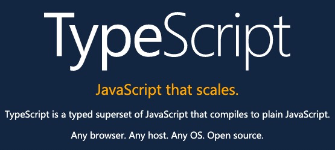

# TypeScript 大纲

[TOC]

## 课程介绍

`JavaScript` 由于历史原因以及各种机缘巧合，成为了目前使用最广泛的前端开发语言，但是也还是因为一些历史原因，在语言设计上同时有很多的一些不足，特别是现代应用工程越来越庞大和复杂，参与的协同人员也越来越多，`JavaScript` 受限于本身的一些特性（动态弱类型），使得针对工程化项目的开发有些难以应付。广大的开发者制定了各种规范和工具来弥补这些不足，比如 `ESLint`，不过它远远不能满足我们的要求，而且规范不是人人都遵守，工具也不是人人都使用，总的来说，约束力不够，如果能够直接从语言层面上来解决这个问题是一个不错的方式，`TypeScript` 就是我们的选择

`TypeScript` 是由微软开发的一门语言，它是 `JavaScript` 类型的超集，它可以编译成纯 `JavaScript` 运行在浏览器端，它包含两个核心部分的内容：

- 类型系统
- 对 `JavaScript`  `ECMAScript` 的扩展（支持新的`ECMAScript`新特性或未来即将标准化的新特性）

**`TS` 能为我们做什么？ **

- 通过 `TS` 类型约束、检测 帮助我们改善代码质量
- 通过 `TS` 类型约束、检测，减少错误，提高开发效率
- 还是 `TS` 类型标注 降低维护难度

目前，越来越多的公司、项目（比如：Angular、Vue3+、Ant Design、Vscode……）都是（或即将）使用 `TypeScript` 来进行开发或者重构，即使一些没有使用的项目，也通过 `TypeScript` 的类型定义文件 `*.d.ts` 来提供类型支持，可以说 `TypeScript` 是前端的发展趋势，掌握 `TypeScript` 也是提升自己个人职场竞争力的一种方式，也是面试的加分项。

## 学前基础

因为 `TypeScript` 是对 `JavaScript` 的扩展，所以学习本课程需要具备 `JavaScript` 的基础

- 熟悉语法基础（变量、语句、函数等基础概念）
- 掌握内置对象（<u>Array</u>、<u>Date</u> 等）的使用
- 面向对象基本概念（构造函数、原型、继承）

因为 `TypeScript` 也包含了 `ECMAScript2015+` （也就是 `ECMAScript6+`） 以及未来即将支持的特性，所以本课程也会对这部分所涉及到内容进行介绍

## 课程编排

在视频中除了讲述知识点，还会穿插着各种知识点的具体使用场景与案例，让大家更好的学 习 `TypeScript`，在视频讲解过程中还会提出一些问题让大家去思考，同时每个章节、阶段之后都会附有对应的练习或测试，来帮助大家巩固学习。课程中的所有相关问题，大家可以在群内和我们沟通

## 章节目录

### 第一章 TypeScript初体验

### 第二章 类型系统

### 第三章 高级类型与接口

### 第四章 函数详解

### 第五章 面向对象编程-类

### 第六章 类型系统深入

### 第七章 泛型

### 第八章 模块系统与命名空间

### 第九章 装饰器

### 第十章 声明文件

### 第十一章 JSX

### 第十二章 Vue / React / Angular & TypeScript

### 第十三章 配置详解